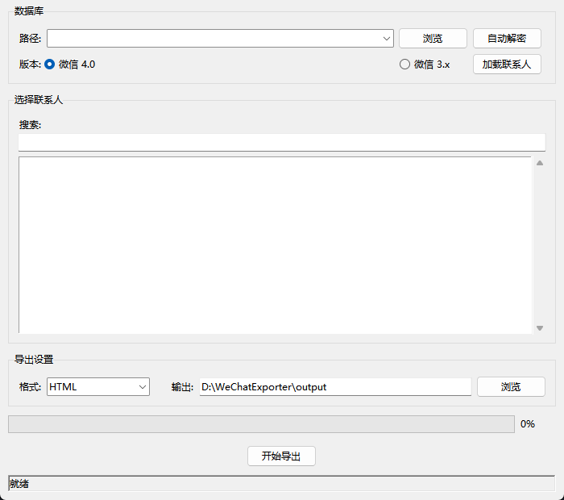

# WeChatMemo

微信聊天记录导出工具，支持 GUI 可视化操作。

基于 [CosilC/WeChatMsgArchive](https://github.com/CosilC/WeChatMsgArchive) 整理优化。



## 免责声明

> ⚠️ **本项目仅供学习 AI 技术使用，不得用于任何商业或非法用途。**
> 
> - 本工具用于导出个人聊天数据，以训练专属的 AI 聊天助手
> - 使用本工具导出的聊天记录请妥善保管，不得侵犯他人隐私
> - 请遵守当地法律法规，不得将本工具用于非法活动
> - 本项目基于 MIT 许可证发布，作者不对使用本工具造成的任何后果负责

## 功能

- 解密微信本地数据库（支持微信 3.x / 4.0）
- 可视化选择联系人，一键导出聊天记录
- 支持多种导出格式：HTML、TXT、DOCX、Excel、Markdown
- 还原微信聊天界面（文本、图片、表情包）

## 项目结构

```
WeChatMemo/
├── src/
│   ├── gui.py            # GUI 界面
│   ├── wxManager/        # 核心模块（数据库读取、解密）
│   └── exporter/         # 导出模块
├── example/              # 命令行示例脚本
├── doc/                  # 文档
├── data/                 # 解密后的数据库（git 忽略）
├── output/               # 导出结果（git 忽略）
└── logs/                 # 日志文件（git 忽略）
```

## 环境要求

- Windows 10 / 11
- 微信已登录
- 微信版本 ≤ 4.0.3.36（更高版本需要降级，见下方说明）

## 快速开始（小白教程）

### 第一步：下载程序

1. 点击右侧 [Releases](https://github.com/shf-275599/WeChatMemo/releases) 下载最新版
2. 解压到任意文件夹（比如 `D:\WeChatMemo`）
3. 双击 `WeChatMemo.exe` 启动

### 第二步：确认微信版本

打开微信 → 点击左下角「设置」→ 关于微信 → 查看版本号

| 版本 | 能否使用 |
|------|---------|
| 4.0.3.36 及以下 | ✅ 直接使用 |
| 4.0.3.39 ~ 4.1.x | ❌ 需要降级（见下方） |

**如果你的版本太高，需要降级：**

1. 下载 [WeChatWin_4.0.3.36.exe](https://github.com/iibob/wechat-win-archive/releases/tag/v4.0.3.36)
2. **不要卸载现有微信**，直接运行下载的安装包覆盖安装
3. 安装完成后重新登录微信

### 第三步：自动解密数据库

1. **确保微信已登录**（必须在登录状态）
2. 打开 `WeChatMemo.exe`
3. 选择版本：**微信 4.0**（默认）
4. 点击 **「自动解密」** 按钮
5. 等待解密完成（通常 1-2 分钟）
6. 完成后会显示「解密成功: wxid_xxx」

> ⚠️ **如果解密失败：**
> - 确认微信已登录
> - 重启微信后重试
> - 检查微信版本是否 ≤ 4.0.3.36
> 
> 📁 **解密后的数据存在哪里？**
> 
> 所有数据均存储在 `WeChatMemo.exe` 所在的目录下：
> 
> ```
> exe 所在目录/
> ├── data/
> │   └── wxid_xxxxxxxxx/       ← 解密后的微信数据库
> │       └── db_storage/        ← 微信 4.0（或 Msg/ ← 微信 3.x）
> ├── output/                    ← 导出的聊天记录
> ├── logs/                      ← 运行日志
> └── config.json                ← 程序配置
> ```
> 
> 也就是说，你把 `WeChatMemo.exe` 放在哪个文件夹，数据就存到哪里。换电脑直接把整个文件夹拷走即可。

### 第四步：加载联系人

1. 解密成功后，路径会自动填入
2. 点击 **「加载联系人」** 按钮
3. 等待加载完成，左侧会显示所有联系人列表

### 第五步：选择联系人

1. 在搜索框输入关键词可以筛选联系人
2. 点击列表中的联系人名称选中它
3. 群聊会显示 `[群]` 前缀

### 第六步：导出聊天记录

1. 选择导出格式：
   - **HTML**：推荐，保留聊天界面样式，可直接用浏览器打开
   - **TXT**：纯文本，体积小
   - **DOCX**：Word 文档
   - **Excel**：表格格式，适合数据分析
   - **Markdown**：Markdown 格式
2. 选择输出文件夹（默认是 `output` 文件夹）
3. 点击 **「开始导出」**
4. 等待导出完成
5. 去输出文件夹查看导出的文件

## 使用已有数据库

如果你之前已经解密过数据库，可以直接使用：

1. 点击 **「浏览」** 按钮
2. 选择 `data/wxid_xxx/db_storage` 文件夹
3. 点击 **「加载联系人」**
4. 后续步骤同上

## 命令行使用（进阶）

### 解密数据库

```bash
python example/1-decrypt.py
```

### 查看联系人

编辑 `example/2-contact.py`，修改 `db_dir` 和 `db_version`，然后：

```bash
python example/2-contact.py
```

### 导出聊天记录

编辑 `example/3-exporter.py`，修改 `db_dir`、`db_version`、`wxid`，然后：

```bash
python example/3-exporter.py
```

## 常见问题

### Q: 点击自动解密没反应 / 闪退？

- 右键以管理员身份运行
- 确保微信已登录且版本 ≤ 4.0.3.36

### Q: 提示「未找到密钥」？

- 重启微信后重试
- 确认微信版本 ≤ 4.0.3.36

### Q: 提示「未找到微信进程」？

- 确保微信已登录（不是最小化，是真正登录状态）
- 重启微信后重试

### Q: 导出的 HTML 打开后图片不显示？

- 需要在导出的文件夹中打开 HTML 文件（图片使用相对路径）

### Q: 解密后想重新解密？

- 删除 `data/wxid_xxx` 文件夹
- 重新点击「自动解密」

### Q: 杀毒软件报警？

- 程序无毒，手动放行即可
- 因为程序需要读取微信内存，部分杀毒软件会误报

### Q: 支持 Mac / Linux 吗？

- 不支持，仅支持 Windows

## 性能说明

### 内存占用

- 解密过程：约 200-500 MB（取决于数据库大小）
- 导出过程：约 100-300 MB

### 导出速度

- 文本消息：约 1000-3000 条/秒
- 图片/视频：取决于文件大小和硬盘速度
- 语音消息：需要额外解码，较慢

### 优化建议

1. **关闭其他程序**：释放内存给导出工具
2. **使用 SSD**：大幅提升文件复制速度
3. **分批导出**：如果联系人很多，可以分几次导出
4. **选择 TXT 格式**：如果只需要文本，TXT 格式最快

## 从源码运行

```bash
# 安装依赖
pip install -r requirements.txt -i https://pypi.tuna.tsinghua.edu.cn/simple

# 运行 GUI
python src/gui.py
```

## 许可证

[MIT](./LICENSE)

## 致谢

- [LC044/WeChatMsg](https://github.com/LC044/WeChatMsg) — 原项目
- [iibob/wechat-win-archive](https://github.com/iibob/wechat-win-archive) — 微信历史版本存档
- [xaoyaoo/PyWxDump](https://github.com/xaoyaoo/PyWxDump) — PC 微信工具
